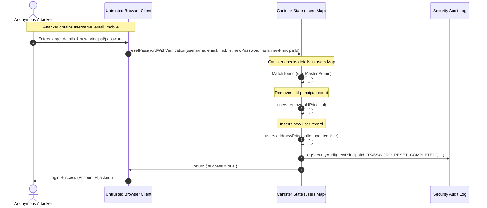
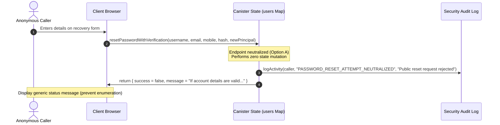
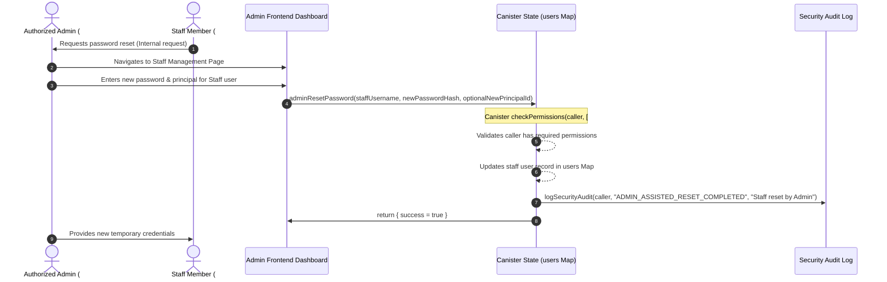
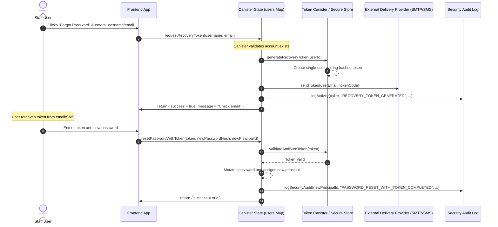

# Enterprise Security Specification: Password Recovery Hardening (P2-WP-007A)
## Work Package: P2-WP-007A.2 — Enterprise Password Recovery Security Specification
## Documentation-Only Security Design Document

---

## 1. Document Control

| Metadata Field | Value |
| :--- | :--- |
| **Project** | Gujarat Art & Craft ERP |
| **Work Package** | P2-WP-007A.2 — Enterprise Password Recovery Security Specification |
| **Version** | 1.0 |
| **Status** | APPROVED — Security Specification Frozen |
| **Canonical Path** | `docs/runtime/phase-2/security/P2-WP-007A-Security-Specification.md` |
| **Approved Baselines** | Phase 0: Enterprise Development Constitution (`phase-0-approved-v1.0`) <br> Phase 1: Enterprise Architecture Specification (`phase-1-approved-v1.0`) <br> Phase 2.0: Runtime Baseline (`phase-2.0-baseline-approved-v1.0`) |
| **Current Branch** | `phase-2-runtime-development` |
| **Security Gate** | **Approved for Controlled Implementation** |
| **Implementation Status**| Authorized but Not Started |
| **ARB Status** | Approved |
| **Architecture Status** | Frozen |
| **Approval** | Approved |
| **Date** | 2026-07-14 |
| **Scope** | Secure architecture design, rules, and requirements for password recovery, credential modification, and principal identity re-assignment in the canister backend and UI frontend. |
| **Out of Scope** | Full OTP provider implementation, SMS/email provider integration, unrelated authentication refactoring, session architecture redesign, Master Admin deployment configuration (P2-WP-007B), general Phase 2.1 refactoring. |
| **Assumptions** | 1. Canister execution environment on the Internet Computer Protocol (ICP) is secure and tamper-proof.<br>2. React/TypeScript client-side browser is an untrusted environment.<br>3. Recovered accounts have registered details (username, email, mobile) that are low-entropy (potentially knowable or public). |
| **Dependencies** | 1. Canister user record storage system (`users` map in state).<br>2. Canister activity and security audit logging systems. |

---

## 2. Purpose

The password recovery architecture in its current form represents a critical security exposure. The existing anonymous endpoint allows any caller to reassign the password hash and the owner principal ID of any account, including the Master Admin and other privileged roles, by providing only public or low-entropy details (username, email, and mobile number). 

The remediation design is approved. Runtime remediation remains pending. This specification establishes a frozen security design and recovery policy framework. Implementing runtime changes is authorized but not started, awaiting formal deployment sequencing to ensure:
1. Preventative controls are in place to block unauthorized account-takeover.
2. The integrity of administrative and operational identities remains protected.
3. API contracts remain backward-compatible where necessary, or versioned changes are planned safely.
4. Security logging maintains accountability without leaking sensitive credentials.

---

## 3. Scope

### In Scope
- **Verification Endpoint Hardening**: Hardening the logic of `resetPasswordWithVerification` to evaluate roles, enforce access policies, and prevent unauthorized state modification.
- **Privileged Account Protections**: Prohibiting anonymous/public recovery of `#Admin` (Master Admin) and `#Manager` (Admin) accounts.
- **Identity Re-assignment Controls**: Enforcing server-side policies for mutating principal IDs in the user storage canister.
- **Audit Logging**: Establishing standard audit patterns that capture telemetry, caller classification, and target roles without disclosing private user credentials.
- **Frontend UX Integration**: Defining UI feedback patterns that prevent account enumeration and handle restricted recovery states gracefully.
- **Mock Backend Alignment**: Restricting `mockBackend.ts` to replicate hardened production policies and prevent gaps between dev/prod configurations.
- **Candid & Code Compatibility**: Standardizing signature bindings to prevent compilation breakage during canisters updates.

### Out of Scope
- Integration with external SMS or Email gateways/APIs.
- Implementation of a complete multi-factor OTP generation/delivery service.
- Broad session lifecycle redesign or token-based session persistence updates.
- Canister deployment scripts, configuration files, and key management specific to Master Admin provisioning (P2-WP-007B).
- General refactoring of the backend storage or other Phase 2.1 features.

---

## 4. Current Recovery Architecture

The current audited recovery flow utilizes the anonymous endpoint `resetPasswordWithVerification` in the canister. The workflow executes as follows:

```
[Browser Client]
   |
   |-- (1) Collects username, email, mobile, newPasswordHash, newPrincipalId
   v
[Temporary Anonymous Actor]
   |
   |-- (2) Calls resetPasswordWithVerification(username, email, mobile, hash, newPrincipalId)
   v
[Canister: resetPasswordWithVerification]
   |
   |-- (3) Iterates through all users in the 'users' Map
   |-- (4) Checks if details match username, email, and mobile
   |-- (5) If matched:
   |      a. Identifies old principal from matching record
   |      b. Removes old record: users.remove(oldPrincipalText)
   |      c. Inserts new record: users.add(newPrincipalId, updatedUser)
   |      d. Logs audit record with the new principal as caller
   |-- (6) Returns success message
   v
[Browser Client]
   |
   |-- (7) Clears browser session and redirects user to sign in
```

> [!WARNING]
> This flow represents a critical security hazard. It trusts the client-supplied `newPrincipalId` and changes state for any matching record, allowing any user (including external anonymous actors) to hijack the Master Admin and Manager identities without cryptographic proof of ownership of either the old or new principal.

---

## 5. Threat Model Summary

The threat model highlights vulnerabilities within the current recovery process.

*   **SEC-FIND-001: Anonymous Account Hijacking of Privileged Accounts**
    *   **Severity**: Critical
    *   **Description**: The endpoint accepts requests to reset the password and principal ID of any user. Attackers with access to username, email, and mobile details can easily hijack the Master Admin (`#Admin`) or Manager (`#Manager`) accounts.
    *   **Status**: *The reviewed implementation presents a potential account-takeover path based on the audited authorization flow. Practical exploitability remains subject to controlled security validation.*

*   **SEC-FIND-002: Lack of Rate Limiting / Brute-Force Exposure**
    *   **Severity**: High
    *   **Description**: The canister lacks attempt counters or rate limits on verification checks, permitting rapid automated brute-force attempts on recovery fields.
    *   **Status**: *Practical exploit reproduction remains pending unless separately verified.*

*   **SEC-FIND-003: Recovery Fields Information Leakage**
    *   **Severity**: Medium
    *   **Description**: The verification criteria rely on metadata fields (email, mobile) that may be easily discoverable or public, failing to provide high-entropy validation.
    *   **Status**: *Practical exploit reproduction remains pending unless separately verified.*

*   **SEC-FIND-004: Audit Log Spoofing and Integrity Gaps**
    *   **Severity**: High
    *   **Description**: The canister writes logs using the newly associated principal as the operator, leaving no record of the actual requesting actor or verification failures.
    *   **Status**: *Practical exploit reproduction remains pending unless separately verified.*

*   **SEC-FIND-005: Replay and Re-association Vulnerability**
    *   **Severity**: Medium
    *   **Description**: The API requires direct passage of `newPrincipalId` and `newPasswordHash` without cryptographic nonces, allowing request capture and replaying.
    *   **Status**: *Practical exploit reproduction remains pending unless separately verified.*

*   **SEC-FIND-006: Denial of Service / Account Lockout**
    *   **Severity**: High
    *   **Description**: Attackers can deliberately trigger resets with bogus principal IDs to lock out legitimate managers and administrators.
    *   **Status**: *Practical exploit reproduction remains pending unless separately verified.*

---

## 6. Security Objectives

1.  **Privileged Account Protection**: Anonymous public recovery endpoints must reject resets for `#Admin` (Master Admin) and `#Manager` (Admin) accounts.
2.  **Explicit Authorization**: Identity and principal mutations must be validated against strict server-side policies. Client-supplied IDs must never be blindly trusted.
3.  **Account Enumeration Prevention**: Recovery failures or attempts on non-existent accounts must return uniform, non-revealing generic responses.
4.  **Audit Integrity**: Audit trails must capture the calling principal's context and record verification failures under a standardized security logging schema.
5.  **Safe State Mutation**: Reassigning a principal ID must be atomic, verifying that the new principal does not conflict with existing registered identities.
6.  **Candid Interface Stability**: Ensure security controls are enforced while keeping Candid signature compatibility intact where possible.

---

## 7. Functional Requirements

*   **SEC-FR-001: Account Lookup and Duplicate Metadata**  
    The public recovery endpoint must not use account lookup results to mutate data. If internal administrative recovery resolves zero or multiple matching records, the operation must fail safely. Duplicate username/email/mobile metadata must never result in an arbitrary account selection.
*   **SEC-FR-002: Public Recovery Blocking**  
    Public anonymous recovery must be blocked for `#Admin`, `#Manager`, and `#Staff` accounts. No role is eligible for direct anonymous principal reassignment.
*   **SEC-FR-003: Caller Classification**  
    Every recovery event must log whether the caller is authenticated or anonymous. Anonymous callers are represented by the platform anonymous Principal (`2vxsx-gae`). Telemetry must not claim that a distinct real-world identity can be derived from an anonymous caller.
*   **SEC-FR-004: Principal Conflict Handling**  
    If a requested principal already belongs to another user in the canister state, the canister must reject the change and return a structured generic failure. The canister must perform no partial state mutations, must not overwrite another principal mapping, and must log only a safe reason category.
*   **SEC-FR-005: Password Mutation Conditions**  
    A password mutation is allowed only when all of the following conditions are met:
    - The caller is authenticated.
    - The caller is active.
    - The caller has the required recovery permission (`canManageStaff` or similar, based on target role).
    - The target role is permitted under the active recovery policy.
    - The target account is active (unless an approved reactivation procedure applies).
    - The target record is uniquely identified.
    - Principal conflict checks pass.
    - The complete operation can be applied atomically.
    - A security audit event is recorded.
*   **SEC-FR-006: Principal Reassignment**  
    Public anonymous recovery may never perform principal reassignment. Administrative reassignment requires an authenticated, authorized actor and a separately approved ownership proof or reset policy. Master Admin reassignment remains governed by the explicit ownership-transfer process.
*   **SEC-FR-007: Response Behavior**  
    The public recovery endpoint must return the exact same generic response regardless of whether the target is an unknown account, an existing account, a privileged role, a disabled account, or represents a metadata mismatch. The response must not reveal account existence or role mapping details.
*   **SEC-FR-008: Audit-Event Generation**  
    Every password recovery event (initiations, successes, policy blocks, and data mismatches) must generate a persistent security audit record.
*   **SEC-FR-009: Failed-Attempt Behavior**  
    If the provided fields do not match an active user, the canister must log a verification failure and return a generic success-like message to prevent account enumeration.
*   **SEC-FR-010: Session Invalidation Behavior**  
    Upon a successful password reset, any cached client sessions or active authentications for both the old and new principals must be flagged as invalidated.
*   **SEC-FR-011: Mock Backend Parity**  
    The React mock backend (`mockBackend.ts`) must mirror the production canister's validation policies, including blocking privileged resets and matching error payloads.
*   **SEC-FR-012: Frontend Message Behavior**  
    The frontend UI must display consistent, generic messages (e.g., *"If the account details are correct, a recovery process has been initiated"*), never exposing role-blocking status.
*   **SEC-FR-013: Duplicate Recovery Metadata Handling**  
    Recovery metadata must not be assumed unique unless enforced by the backend constraints. If a query resolves zero matches or multiple matches, the operation must fail safely and return the standard generic failure. No matching record may be selected arbitrarily. The event must be logged using a safe reason code such as `RECOVERY_TARGET_NOT_UNIQUE`. Sensitive metadata must not be written to logs.

---

## 8. Non-Functional Requirements

*   **SEC-NFR-001: Backward Compatibility**  
    The hardened canister must preserve the Candid method signature of `resetPasswordWithVerification` to prevent client compilation failures.
*   **SEC-NFR-002: Availability**  
    Hardening controls (such as local fail-counters) must not lead to permanent denial-of-service for legitimate accounts.
*   **SEC-NFR-003: Performance**  
    Normalization, role lookup, and map mutations must execute within acceptable canister instruction cycles, preventing timeout vectors.
*   **SEC-NFR-004: Observability**  
    Canister administrators must be able to query log tables to detect brute-force patterns on recovery fields.
*   **SEC-NFR-005: Privacy**  
    Audit logs and execution traces must not write plain-text password hashes, email addresses, or mobile numbers.
*   **SEC-NFR-006: No Sensitive Error Leakage**  
    Internal canister trap messages or debug traces must not be returned in API call responses.
*   **SEC-NFR-007: Auditable Recovery**  
    The mutation of security-critical mappings (principals and password hashes) must be logged in a dedicated, tamper-evident canister log.
*   **SEC-NFR-008: Deterministic Behavior**  
    The canister recovery check must evaluate conditions in a deterministic sequence, guaranteeing consistent state outputs.
*   **SEC-NFR-009: Upgrade Safety**  
    The hardening changes must not alter the stable storage memory layout, preserving existing user lists during canister upgrades.
*   **SEC-NFR-010: Regression Safety**  
    Verification routines must undergo regression testing on both mock and live canisters to confirm login flows for existing users remain functional.

---

## 9. Master Admin Recovery Policy

The Master Admin role (`#Admin` internally, managing settings and staff lists) represents the root of trust in the ERP canister. The recovery policy for this account is defined as follows:

1.  **Absolute Public Prohibition**: Self-service recovery for the Master Admin account via the public `resetPasswordWithVerification` API is strictly prohibited.
2.  **No Low-Entropy Recovery**: The Master Admin account credentials and principal cannot be mutated based on username, email, and mobile parameters.
3.  **No Client-Controlled Reassignment**: The canister will reject any attempt to bind a new principal to the Master Admin account when called through anonymous interfaces. The client-supplied `newPrincipalId` must never directly replace the Master Admin principal through a public endpoint.
4.  **Out-of-Band / Offline Recovery**: Recovering the Master Admin account requires a separately approved, manual/offline controlled procedure (e.g., canister upgrade with migration parameters, or invocation of secure deployment scripts by authorized custodians). The manual procedure must require:
    - Explicit approval.
    - Verified canister state backup.
    - Audited change record.
    - Staging validation.
    - Rollback plan.
    *Do not define unverified DFX commands as the final recovery procedure.* The exact operational recovery runbook remains a required deliverable under P2-WP-007B or a dedicated security operations work package.
5.  **Auditing**: Any attempt to trigger recovery for the Master Admin must trigger a critical-level security log event.
6.  **Explicit Transfer**: Ownership of the Master Admin identity can only be transferred using authenticated, signature-verified calls from the existing Master Admin principal.
7.  **No Automatic Self-Service**: The frontend application must block or not expose self-service recovery options for the `admin` username.

---

## 10. Admin Recovery Policy

The Admin role (mapped to `#Manager` in the canister and UI Admin in the frontend) represents managers with access to settings, inventory, sales, and employee lists.

1.  **Public Recovery Restriction**: Public anonymous recovery via `resetPasswordWithVerification` is strictly prohibited.
2.  **Administrative Reset**: Resets may only be performed through an authenticated, Master Admin-assisted reset operation. The existing authenticated administrative reset endpoint may be reused only after caller-role and target-role authorizations are verified.
3.  **Audit Mandate**: All manager credential resets must be logged, documenting the admin caller, the target username, and the timestamp.
4.  **Role & Permissions Retention**: Manager resets must only update the password hash and/or principal; role, status, department, and permissions must remain unchanged.

---

## 11. Staff Recovery Policy

The Staff role (`#Staff`) represents standard operational users with limited permissions.

1.  **Public Recovery Restriction**: Public anonymous recovery via `resetPasswordWithVerification` is strictly prohibited.
2.  **Assisted Recovery**: Staff resets may only be performed through an authenticated, authorized Admin or Master Admin-assisted operation.
3.  **Identity Resolution**: Duplicate metadata must not be used to identify the target Staff member. Administrative resets must prefer stable user or principal identifiers.
4.  **Future Token Transition**: A secure, single-use, expiring token or OTP recovery architecture is deferred to a separately approved future work package and remains out of scope.

---

## 12. Future OTP or Recovery Token Policy

*This section defines requirements for future implementation. No OTP logic will be built during the current phase.*

1.  **Canister-Generated Tokens**: Recovery tokens must be generated cryptographically on the canister using a secure random seed.
2.  **Single-Use and Expiring**: Tokens must expire within a short window (e.g., 15 minutes) and must be revoked immediately upon use.
3.  **Brute-Force & Rate Limiting**: The token submission handler must enforce rate limits (e.g., maximum 3 attempts per token) to prevent guessing.
4.  **Secure Storage**: Tokens must be stored in canister memory as salted hashes, preventing exposure through canister state inspectability.
5.  **Out-of-Band Delivery**: Delivery must occur via a secure email/SMS canister integration.
6.  **Telemetry Auditing**: Generating and validating recovery tokens must write detailed event records in the security log, omitting token hashes.

---

## 13. Authorization Rules

*   **SEC-AUTH-001: Protected Mutations Reject Anonymous Callers**  
    Any endpoint that mutates system settings, user credentials, or financial ledgers must reject anonymous callers (`Principal.toText(caller) == "2vxsx-gae"`).
*   **SEC-AUTH-002: Anonymous Endpoints Allowlisted**  
    Only endpoints explicitly designated for public access (such as initial login validation, public system status, and neutralized recovery requests) may accept anonymous calls.
*   **SEC-AUTH-003: Anonymous Recovery Cannot Mutate Privileged Accounts**  
    The anonymous password recovery handler must reject state updates if the target account holds the `#Admin` or `#Manager` role.
*   **SEC-AUTH-004: Role Mapping Unchanged**  
    Password recovery mutations must keep the user's role mapping (`#Admin`, `#Manager`, `#Staff`) unchanged.
*   **SEC-AUTH-005: Active-User Validation**  
    Recovery requests are only valid for users whose account status is explicitly set to `"active"`.
*   **SEC-AUTH-006: Ownership Validation**  
    Reassigning a principal ID through public recovery requires proof of ownership of the new principal (e.g., verifying a signed challenge).
*   **SEC-AUTH-007: Disabled Accounts Cannot Initiate Privileged Recovery**  
    Inactive or disabled accounts must be blocked from initiating any recovery flow.
*   **SEC-AUTH-008: Master Admin Protections Remain Absolute**  
    No public canister endpoint, regardless of the parameters supplied, can modify the Master Admin's principal ID or password hash.

---

## 14. Principal Reassignment Rules

1.  **Authorized Reassignment**: Reassigning a user's principal ID is permitted only during:
    - An admin-assisted reset using the authenticated `adminResetPassword` endpoint.
    - A verified out-of-band recovery procedure for the Master Admin.
2.  **Reassignment Prohibitions**: Reassigning a principal is blocked if:
    - The target is a privileged account being updated via the anonymous recovery endpoint.
    - The new principal ID is already associated with another active user.
3.  **Duplicate Detection**: Before assigning `newPrincipalId`, the canister must verify that no other record in the `users` map is keyed under that principal ID.
4.  **Old Principal Revocation**: The old principal association must be deleted from the `users` map, invalidating any active API calls signed by the old key.
5.  **Ownership Verification**: In token-based recovery, the reset request must be signed by the new principal key, verifying control over the target identity.
6.  **Transactional Atomicity**: The state update (removing the old principal record and writing the new record) must execute within a single atomic canister transaction.
7.  **Rollback on Failure**: If any write or validation step fails during the mutation, the state must roll back to the original principal mapping.
8.  **Audit Logs**: Every principal change must record the old principal, the new principal, and the modifying administrator's identity.

---

## 15. Audit Logging Rules

*   **SEC-AUD-001: Log Recovery Events**  
    The canister must log all password recovery attempts, success status, and error classifications in the security audit table.
*   **SEC-AUD-002: Caller Context Collection**  
    Logs must capture the requesting caller principal (anonymous or authenticated) to record the origin of the event.
*   **SEC-AUD-003: Categorize Matched Accounts**  
    The audit log must identify the target role category (`#Admin`, `#Manager`, `#Staff`) without revealing sensitive personal details (e.g., names, phone numbers).
*   **SEC-AUD-004: Record Principal Shifts**  
    When a principal reassignment occurs, the audit log must record the transition from the old principal ID to the new principal ID.
*   **SEC-AUD-005: Prohibit Sensitive Data Logging**  
    Audit logs, debug logs, and output messages must never record raw passwords, password hashes, recovery token values, or private keys.

---

## 16. Error Handling Policy

1.  **Generic Responses**: The public recovery endpoint must return identical generic success/error messages for all validation failures, preventing user enumeration.
2.  **No Enumeration Leakage**: The response message must not differentiate between:
    - Username not found.
    - Incorrect email/mobile details.
    - Blocked privileged accounts.
3.  **No Stack Traces**: Canister exceptions and internal call stacks must be caught internally and not returned in client payloads.
4.  **No Partial State Mutation**: If validation fails at any point, the canister must exit without modifying user mappings or password hashes.
5.  **Structured Responses**: Errors must return a standard type (e.g., `{ success: Bool; message: Text }`), providing consistent behavior for the UI.
6.  **Controlled Traps**: Canister traps (`Runtime.trap()`) should be reserved for unexpected internal execution errors or unauthorized authenticated calls, rather than public validation failures.

---

## 17. API Contract

The current Candid interface for password recovery is:

```candid
resetPasswordWithVerification : (text, text, text, text, text) -> (record { success : bool; message : text })
```

### Parameters
1.  `username`: The user identifier (case-insensitive, trimmed).
2.  `email`: The registered email address (case-insensitive, trimmed).
3.  `mobile`: The registered mobile number (spaces stripped).
4.  `newPasswordHash`: The pre-hashed value of the new password.
5.  `newPrincipalId`: The string representation of the new principal to associate.

### Hardened Behavioral Restrictions
- The method signature remains unchanged to ensure Candid compatibility.
- The public `resetPasswordWithVerification` endpoint must reject or safely neutralize recovery attempts for all roles.
- It must perform no password mutation, no principal reassignment, and no user-record deletion or insertion.
- It must return a generic non-enumerating response:
  ```json
  { "success": false, "message": "If account details are valid, recovery will continue." }
  ```
- It must log a safe security event without exposing whether the account exists.

---

## 18. Candid Compatibility and Target Interface Behavior

The following table distinguishes the compatibility elements under the approved architecture.

| Compatibility Layer | Characteristics | Impact on System |
| :--- | :--- | :--- |
| **Candid Signature Compatibility** | Preserves method parameter signature (`Text, Text, Text, Text, Text -> Record`). | Existing frontend callers compile without modifications. |
| **Behavioral Incompatibility** | Intentionally rejects and neutralizes all public re-assignment mutations. | Callers receive generic, non-mutating failure/neutralized messages. |
| **Operational Workflow Change** | Recovery shifts from public anonymous self-service to administrative assistance. | Master Admin manages Admins; Master Admin/Managers manage Staff. |
| **Frontend UX Change** | Recovery screen displays generic message directing users to contact their administrator. | No account detail checking is exposed to the client. |

> [!IMPORTANT]
> Candid signature compatibility may remain intact while password-recovery behavior is intentionally restricted. Existing frontend callers may continue to compile but will receive generic non-mutating responses from the public recovery endpoint.

---

## 19. Backward Compatibility Matrix

| Scenario / Case | Current Behavior | Target Behavior | Compatibility | Required UI Change | Required Backend Change | Risk |
| :--- | :--- | :--- | :--- | :--- | :--- | :--- |
| **Master Admin Recovery** | Allowed via anonymous matching. | Rejected; blocked at canister level. | **Intentional Restricted Behavior** (Signature compatible) | None. Displays generic message. | Block `#Admin` resets in recovery function. | Low. Legacy self-service reset is disabled. |
| **Admin (#Manager) Recovery** | Allowed via anonymous matching. | Rejected; requires Admin-assisted reset. | **Intentional Restricted Behavior** (Signature compatible) | None. Displays generic message. | Block `#Manager` resets in recovery function. | Low. Administrative override path must be verified. |
| **Staff (#Staff) Recovery** | Allowed via anonymous matching. | Rejected; requires Admin-assisted reset. | **Intentional Restricted Behavior** (Signature compatible) | None. Displays generic message. | Block `#Staff` resets in recovery function. | Low. Staff resets must go through the admin dashboard. |
| **Inactive / Disabled Users** | Allows recovery. | Rejected at lookup stage. | Compatible | None. | Add status check during user lookup. | Low. |
| **Unknown Users** | Returns generic failure message. | Returns generic failure message. | Compatible | None. | Match current response format. | Low. |
| **Duplicate Metadata** | Matches first record. | Fails or rejects duplicate matches. | Compatible | None. | Add check to reject if multiple users share metadata. | Low. |
| **Invalid Principal ID** | Attempts to parse and store. | Rejects with generic failure message. | Compatible | None. | Add try-catch block for Principal parsing. | Low. |
| **Existing Sessions** | Session remains active until token clears. | Session immediately invalidated. | Compatible | Handle redirect to login. | Remove old principal from state mappings. | Low. |
| **Mock Backend** | Simulates success for all roles. | Simulates validation rules and blocks resets. | Compatible | None. | Update `mockBackend.ts` to replicate canister checks. | Low. |
| **Historical Audit Logs** | Records new principal as caller. | Records anonymous caller with target role details. | Compatible | None. | Update logging context in recovery function. | Low. |

---

## 20. Remediation Options

### Option A — Disable all anonymous recovery
- **Security Strength**: High. Eliminates the anonymous attack vector entirely.
- **Residual Risk**: None for takeover.
- **Implementation Complexity**: Low. Remove or empty the endpoint logic.
- **Candid Impact**: None if signature remains.
- **Frontend Impact**: Requires modifying the "Forgot Password" UI to direct users to contact their administrator.
- **Backend Impact**: Endpoints returns failure for all callers.
- **Mock Impact**: Align mock responses to reject all calls.
- **Audit Requirements**: Log all recovery attempts as rejected.
- **Rollback**: Re-enable matching logic in canister.
- **Recommendation Status**: **Recommended** (in combination with Option C) to completely secure the system.

### Option B — Block privileged-account anonymous recovery
- **Security Strength**: Medium. Protects Master Admin and Manager accounts while leaving Staff recovery exposed.
- **Residual Risk**: Staff accounts remain vulnerable to metadata-matching attacks.
- **Implementation Complexity**: Low. Add role checks in the recovery function.
- **Candid Impact**: None.
- **Frontend Impact**: None. Displays generic messages for all roles.
- **Backend Impact**: Returns error status for `#Admin` and `#Manager` requests.
- **Mock Impact**: Replicate role check in mock backend.
- **Audit Requirements**: Log blocked attempts for privileged accounts.
- **Rollback**: Remove role checks from the recovery function.
- **Recommendation Status**: Deprecated in favor of Option A + C combination.

### Option C — Admin-assisted recovery for operational users
- **Security Strength**: High. Moves all recoveries to an authenticated, role-restricted admin action.
- **Residual Risk**: Potential administrative overhead during staff password resets.
- **Implementation Complexity**: Medium. Requires verifying frontend admin dashboards.
- **Candid Impact**: None.
- **Frontend Impact**: Add user management controls in the admin dashboard.
- **Backend Impact**: Restricts recovery mutations to authorized callers.
- **Mock Impact**: Update mock backend to support admin-assisted reset flows.
- **Audit Requirements**: Log the admin caller ID and the target user.
- **Rollback**: Re-enable anonymous endpoints.
- **Recommendation Status**: **Recommended** (in combination with Option A) to provide the operational reset path.

### Option D — Secure expiring recovery token
- **Security Strength**: Very High. Replaces metadata checking with single-use cryptographically signed tokens.
- **Residual Risk**: Requires a secure out-of-band delivery channel.
- **Implementation Complexity**: High. Requires canister state memory for token storage.
- **Candid Impact**: Requires adding new endpoints.
- **Frontend Impact**: Add token entry forms in the user interface.
- **Backend Impact**: Requires implementing token generation, validation, and cleanup tasks.
- **Mock Impact**: Requires updating mock backend to simulate token lifecycle.
- **Audit Requirements**: Log token generation and validation events.
- **Rollback**: Revert to metadata matching.
- **Recommendation Status**: Deferred to future development phase.

### Option E — OTP/provider-based recovery
- **Security Strength**: Very High. Multi-factor verification.
- **Residual Risk**: Relies on external SMS or email gateways.
- **Implementation Complexity**: High. Requires external HTTP outcalls or gateway canisters.
- **Candid Impact**: High. Requires adding new endpoints.
- **Frontend Impact**: Add verification screens to the UI.
- **Backend Impact**: Requires configuring external gateway APIs.
- **Mock Impact**: Simulate OTP delivery.
- **Audit Requirements**: Log OTP generation and verification events.
- **Rollback**: Revert to legacy recovery.
- **Recommendation Status**: Deferred to future development phase.

---

## 21. Recommended Architecture Decision

> [!IMPORTANT]
> Final selection requires Architecture Review Board approval and must be recorded in an ADR before runtime implementation.

### Recommended Combined Strategy (Option A + Option C)
1.  **Disable Public Recovery (Option A)**: Neutralize the anonymous `resetPasswordWithVerification` endpoint so it performs zero state mutations (no password hashes or principal changes) for any user role.
2.  **Deploy Admin-Assisted Reset (Option C)**:
    - Master Admin (`#Admin`) resets Admin (`#Manager`) accounts.
    - Master Admin or authorized Admins reset Staff (`#Staff`) accounts via authenticated, role-restricted dashboard actions.
    - Master Admin recovery is restricted to offline, out-of-band procedures.

---

## 22. Sequence Diagrams

### 1. Current Insecure Recovery Flow (Audited)


### 2. Neutralized Public Recovery Flow (Option A + C)


### 3. Target Admin-Assisted Staff Reset Flow (Option C)


### 4. Future Token Recovery Flow (Deferred)


---

## 23. Rollback Strategy

1.  **Git Rollback**: If deployment issues arise, revert the codebase to the `phase-2.0-baseline-approved-v1.0` tag using Git.
2.  **Canister Code Rollback**: Revert canister Wasm to the baseline version by redeploying the audited build.
3.  **Schema Compatibility**: The minimal hardening design introduces no stable storage schema changes to the `users` Map, eliminating the need for complex data migrations during rollback.
4.  **Frontend Rollback**: Roll back frontend build outputs to the baseline release if UI issues occur.
5.  **Mock Backend Rollback**: Revert changes in `mockBackend.ts` to maintain parity with the rolled-back canister.
6.  **Canister Backup Requirement**: Run a canister state backup before applying any upgrades to ensure data can be restored if necessary.
7.  **Recovery Validation**: Perform verification checks immediately after a rollback to confirm that existing users can authenticate.

> [!CAUTION]
> Do not claim automatic state rollback or preservation without complete staging verification. Canister upgrade behavior and state migration must be explicitly tested in an approved DFX environment before production deployment.

---

## 24. Regression Checklist

- [ ] **Public Reset for Master Admin**: Verify that public reset returns the generic response and mutates no data.
- [ ] **Public Reset for Admin**: Verify that public reset for Admin (`#Manager`) returns the same generic response and mutates no data.
- [ ] **Public Reset for Staff**: Verify that public reset for Staff (`#Staff`) returns the same generic response and mutates no data.
- [ ] **Unknown Username**: Verify that an unknown username returns the same generic response.
- [ ] **Incorrect Metadata**: Verify that incorrect verification fields return the same generic response.
- [ ] **Duplicate Metadata**: Verify that duplicate metadata matches return the same generic response.
- [ ] **Existing Principal Conflict**: Verify that an existing principal conflict causes no mutation.
- [ ] **Master Admin to Admin Reset**: Verify that the Master Admin can reset Admin passwords via the authenticated authorized flow.
- [ ] **Master Admin to Staff Reset**: Verify that the Master Admin can reset Staff passwords.
- [ ] **Admin to Staff Reset**: Verify that an authorized Admin can reset Staff passwords only when the permission policy allows.
- [ ] **Admin to Master Admin Block**: Verify that an Admin cannot reset the Master Admin's credentials.
- [ ] **Staff Reset Block**: Verify that a Staff member cannot reset another user's credentials.
- [ ] **Account Attribute Integrity**: Verify that role, permissions, status, and department fields remain unchanged after a credential reset.
- [ ] **Audit Integrity**: Verify that audit logs do not contain raw email, mobile, password hash, recovery tokens, or private keys.
- [ ] **Mock Backend Parity**: Verify that `mockBackend.ts` behavior matches the target canister security policy.
- [ ] **TypeScript Check**: Verify that `npm run typescript-check` passes with zero errors.
- [ ] **Vite Production Build**: Verify that the production Vite build passes successfully on a clean workspace.
- [ ] **Motoko Build and Staging**: Confirm that Motoko compilation and staging canister validation are successfully completed before accepting the code changes.

---

## 25. Acceptance Criteria

*   **SEC-AC-001: Prohibit Anonymous Recovery**  
    All anonymous recovery requests targeting any user role must be blocked at the canister boundary.
*   **SEC-AC-002: Zero Public State Mutations**  
    The public `resetPasswordWithVerification` endpoint must perform zero state mutations (no password modifications, no principal reassignment, no insertions/deletions).
*   **SEC-AC-003: ADR Approved**  
    The Architecture Decision Record (ADR) must be formally approved by the ARB before runtime implementation begins.
*   **SEC-AC-004: Approved Administrative Reset Matrix**  
    The matrix defining which administrative roles can reset credentials for other roles must be formally approved.
*   **SEC-AC-005: Duplicate Metadata Handling**  
    Duplicate metadata checks must fail safely, returning generic responses and logging a safe code without choosing any user record arbitrarily.
*   **SEC-AC-006: Principal Conflict Rejection**  
    Attempts to reassign a principal to an ID already registered to another active user must be rejected safely.
*   **SEC-AC-007: Generic Responses**  
    All validation errors, role blocks, and matching failures must return identical, generic responses to prevent account enumeration.
*   **SEC-AC-008: Approved Audit Logging**  
    The security audit logging configuration must capture event metadata without writing sensitive credentials to stable storage.
*   **SEC-AC-009: Approved Rollback and Regression Plans**  
    Rollback procedures and regression checklists must be reviewed and approved by release engineering.
*   **SEC-AC-010: Staging Verification Passed**  
    Hardening controls must be verified on a staging canister using Motoko compilation tools.
*   **SEC-AC-011: Documentation Signed Off**  
    This security specification must be signed off by the security review team.
*   **SEC-AC-012: Implementation Authorization Granted**  
    The release manager must explicitly authorize the start of the runtime coding phase.

---

## 26. Open Questions and Deferred Items

The following architectural and operational concerns are explicitly deferred and must not block the minimal endpoint neutralization and authenticated admin-assisted reset implementation.

### Deferred Items
1.  **Secure OTP/Token Recovery:** Complete token-based self-service recovery module design.
2.  **Provider Integration:** SMTP, SMS, or WhatsApp communication provider integrations.
3.  **Canister Rate Limiting:** Sliding-window or call-counter rate limits on canister endpoints.
4.  **Production DFX/Staging Environment Setup:** Configured container pipelines for production-like canister upgrades.
5.  **Master Admin Operational Runbook:** Detailed step-by-step procedures for offline recovery of the `#Admin` principal key.
6.  **Duplicate Metadata Cleanup:** Data-repair scripts to detect and clean up existing duplicate email/mobile user records.

---

## 27. Architecture Decision Record Draft

### ADR ID: ADR-2026-001
**Title**: Password Recovery Emergency Hardening and Privileged Account Protection

#### Context
The existing anonymous password recovery endpoint `resetPasswordWithVerification` allows callers to reassign user principals and passwords using only low-entropy details. This represents a critical account-takeover risk, particularly for privileged roles like `#Admin` (Master Admin) and `#Manager` (Admin/Manager).

#### Options Considered
- **Option A**: Disable all anonymous public recovery and principal reassignment.
- **Option B**: Block anonymous recovery for privileged accounts (`#Admin` and `#Manager`) while keeping it active for Staff.
- **Option C**: Use authenticated administrator-assisted resets.
- **Option D**: Implement a secure, time-bound token recovery flow.

#### Proposed Decision
Implement a combination of **Option A** and **Option C**:
- Neutralize the public `resetPasswordWithVerification` endpoint to reject or safely block resets for all user roles, performing zero state mutations.
- Deploy authenticated, role-restricted administrative resets:
  - Master Admin (`#Admin`) resets Admin (`#Manager`) accounts.
  - Master Admin or authorized Admins reset Staff (`#Staff`) accounts.
  - Master Admin recovery uses a separately approved controlled manual/offline procedure.
- Maintain existing Candid signatures to preserve compatibility.

#### Consequences
*   **Positive Consequences**:
    - Completely removes the anonymous account-reassignment attack surface.
    - Preserves the existing Candid method signature, preventing client-side compilation errors.
    - Aligns with corporate ERP recovery workflows and operational controls.
    - Avoids account enumeration by returning identical generic responses.
*   **Negative Consequences**:
    - Self-service recovery becomes unavailable for all roles.
    - Operational reset responsibility moves entirely to authorized administrators.
    - A separate Master Admin recovery procedure is required.
    - A future secure token/OTP architecture remains necessary for self-service.

#### Approval Status
**APPROVED**

#### Decision Authority
**Architecture Review Board**

---

## 28. Implementation Constraints

1.  **No Unrelated Refactoring**: Do not include unrelated refactoring or code cleanup in the security patch.
2.  **No Stash Restoration**: Legacy or unapproved code in Git stashes must not be restored.
3.  **No Role Mapping Changes**: Role definitions and user permissions must not be modified by the recovery handler.
4.  **No Schema Changes**: The stable storage layout must remain unchanged unless a migration plan is separately approved.
5.  **No Endpoint Removal**: Do not remove existing endpoints without reviewing the impact on Candid bindings.
6.  **No Hardcoded Secrets**: Do not store passwords, keys, or recovery secrets in plain text or canister code.
7.  **Validate Client Input**: Do not trust the client-supplied `newPrincipalId` parameter without performing role-based policy checks.
8.  **No Raw Credential Logging**: Do not write plain-text password hashes, email addresses, or phone numbers to logs.
9.  **No Temporary OTPs**: Do not implement temporary OTP generation until a secure delivery provider architecture is approved.

---

## 29. Approval Block

```
Project: Gujarat Art & Craft ERP
Work Package: P2-WP-007A.2 — Enterprise Password Recovery Security Specification
Document: Enterprise Security Specification
Version: 1.0
Status: APPROVED — Security Specification Frozen
Security Gate: Approved for Controlled Implementation
Implementation Status: Authorized but Not Started
ARB Status: Approved
Architecture Status: Frozen
Approval: Approved
Date: 2026-07-14
```
